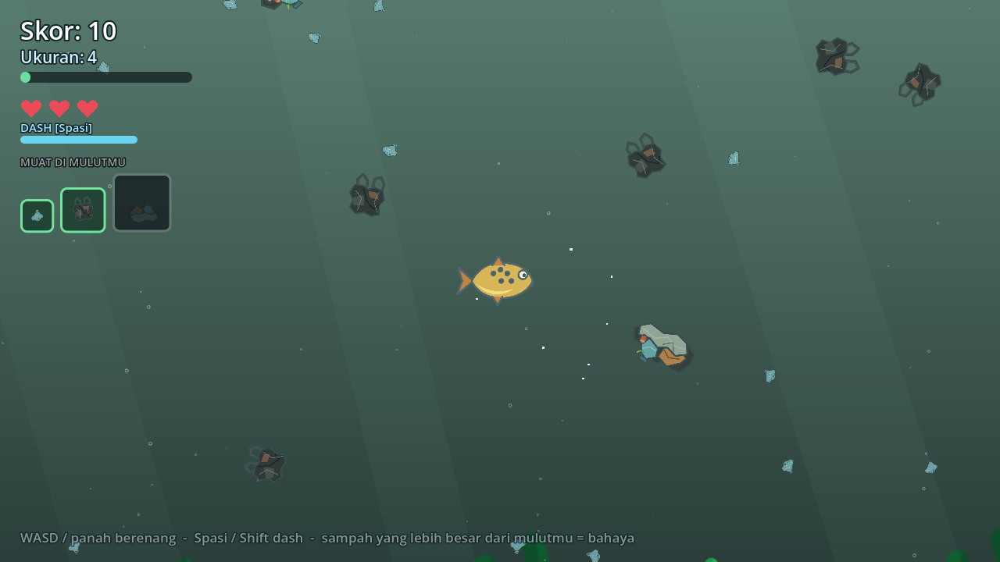
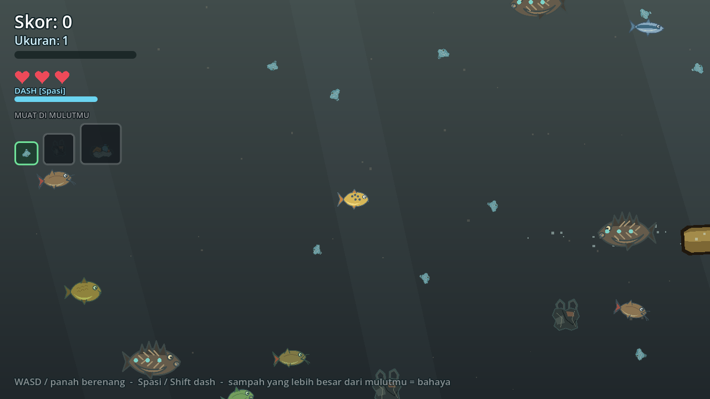
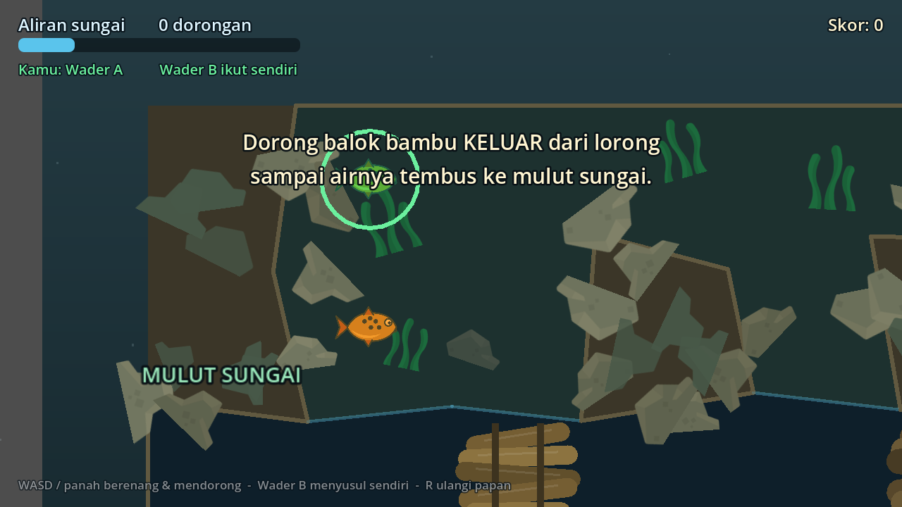
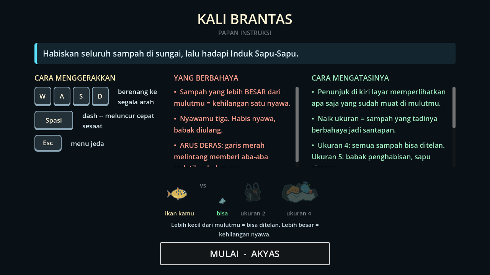
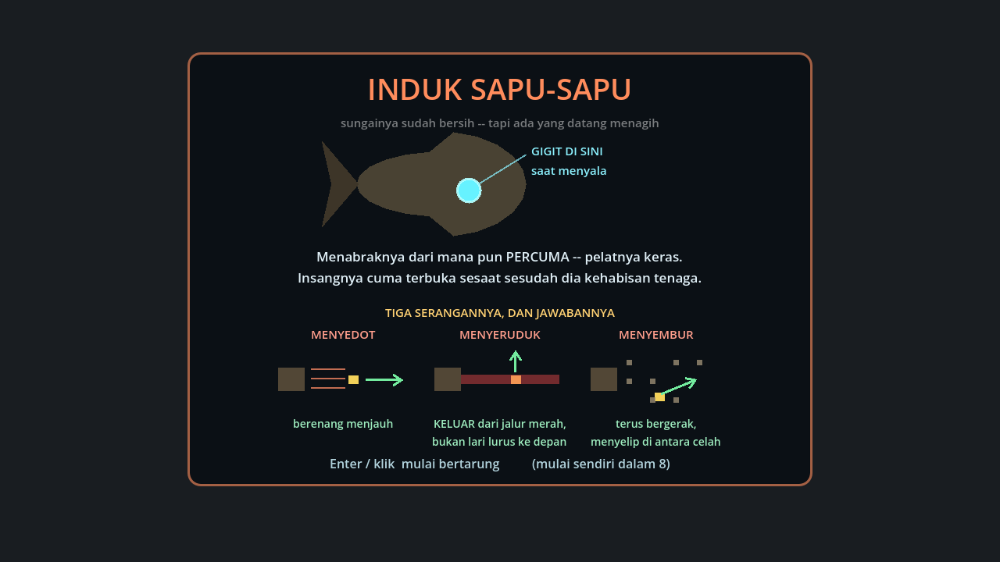

# SAPU-SAPU SUNGAI

> Bersihkan sungainya. Jaga penghuninya.

Game 2D bertema sungai-sungai Indonesia, dibuat dengan **Godot 4.7** untuk
**GEMASTIK XIX 2026 — Divisi Pengembangan Aplikasi Permainan**.

Kamu adalah seekor ikan wader. Tiga sungai sungguhan, tiga masalah yang berbeda —
dan satu kesimpulan yang cuma bisa didapat dengan memainkan ketiganya.

| Bab 1 — Kali Brantas | Bab 2 — Sungai Ciliwung |
|---|---|
|  |  |



Papan instruksi tiap bab — aturan ukuran ditunjukkan, bukan dijelaskan:



Dan kartu bos yang muncul tepat sebelum Induk Sapu-Sapu masuk arena:



---

## Tiga bab, tiga jenis permainan

| Bab | Sungai | Mainnya |
|---|---|---|
| **1** | Kali Brantas, Jawa Timur | Aksi makan-dimakan. Mulai dari sampah kecil, tumbuh, lalu hadapi Induk Sapu-Sapu. |
| **2** | Sungai Ciliwung, Jakarta | Sampahnya lebih padat — dan sekarang ada ikan lokal yang **bukan makanan**. |
| **3** | Kali Jeroan, Madiun | Puzzle dorong balok. Singkirkan sumbatan bambu supaya airnya bisa tembus lagi. |

Aturannya seperti Feeding Frenzy: **kalau sampahnya lebih kecil dari mulutmu, telan.**
Tidak ada cincin atau lencana apa pun — ukuran benda di layar yang menjawabnya, dan HUD
memperlihatkan contoh apa saja yang sudah muat.

Bab 2 punya ambang tersembunyi yang tidak pernah ditampilkan sebagai angka. Kalau
terlalu banyak ikan lokal termakan, airnya menggelap, nada musiknya turun, dan sungai
yang **sudah kamu bersihkan** tetap berakhir banjir. Itu bukan bug — itu isi pesannya.

---

## Menjalankannya

Butuh **Godot 4.7** atau lebih baru. Tidak ada dependensi lain.

```bash
godot --path .
```

Atau buka foldernya lewat Godot Project Manager, lalu tekan **F5**.

### Kontrol

| Tombol | Fungsi |
|---|---|
| `W A S D` / panah | berenang (dan mendorong balok di Bab 3) |
| `Spasi` / `Shift` | dash — Bab 1 & 2 |
| `R` | ulangi papan — Bab 3 |
| `Esc` | menu jeda (ada **Papan Instruksi** di dalamnya) |

Lupa aturannya di tengah main? Buka **Papan Instruksi** dari menu jeda — rondemu tidak
hilang.

---

## Isinya

- **Nama pemain** ditanya di awal, lalu dipakai di menu dan **di dalam naskah ceritanya**
- **Lima babak cerita**: pembuka, dua jembatan antar bab, ending banjir, dan penutup
- **Papan instruksi tiap bab**: tujuan, kontrol, apa yang berbahaya, cara mengatasinya
- **Layar MISI SELESAI** dengan bintang, skor berhitung naik, rekor, dan bab yang terbuka
- **Gelembung oksigen** memulihkan satu nyawa — atau memberi dorongan tenaga kalau
  nyawamu sudah penuh, jadi tidak pernah terasa sia-sia
- **Papan instruksi bergambar**: tuts keyboard digambar sebagai tombol, dan aturan ukuran
  ditunjukkan sebagai perbandingan ikan lawan sampah
- **Jenis sampah terbuka bertahap** — tiap kali ikan naik satu ukuran, satu jenis sampah
  baru mulai muncul di sungai
- **Progres tersimpan** ke `user://sapusapusungai.cfg` — format ConfigFile, bisa dibuka
  pakai Notepad

Alur lengkapnya:

```
kotak nama → menu utama → [cutscene → papan instruksi → bab] → MISI SELESAI → bab berikutnya
```

---

## Susunan berkas

```
scenes/
  maps/        tiga peta bab
  entities/    ikan, sampah, sapu-sapu, bos, balok dorong
  ui/          menu, pilih bab, cutscene, papan instruksi, HUD, layar hasil
scripts/
  autoload/    GameState (progres & simpanan), AudioManager, SceneRouter
  story.gd     SELURUH naskah cerita dan isi papan instruksi, dalam satu berkas
assets/
  aset gemastik/   sprite tujuh spesies ikan, beranimasi
  environment/     sprite sampah & lingkungan
  audio/           bunyi sintetis buatan sendiri
kenney_fish-pack_2/  hiasan rumput air & batu Bab 3 (CC0)
tools/           alat pengembangan (pengambil tangkapan layar)
```

Beberapa keputusan yang sengaja:

- **Naskah dikumpulkan di `scripts/story.gd`.** Naskah adalah bagian yang paling sering
  diubah, jadi harus jadi yang paling gampang ditemukan.
- **Papan Bab 3 ditulis sebagai gambar teks.** Batu, tabrakan, balok, dan aliran airnya
  dibangun sendiri dari denah itu — ubah gambarnya, papannya ikut berubah.
- **Semua perpindahan scene lewat `SceneRouter`,** supaya alamat scene tidak tersebar dan
  tiap perpindahan dapat redup-terang yang sama.

---

## Catatan pengembangan

Tiap bab punya daftar uji sendiri, lengkap dengan hal-hal yang **sudah diverifikasi
otomatis** lewat Godot headless dan hal-hal yang masih butuh dinilai manusia:

- [`UJI_GAME.md`](UJI_GAME.md) — alur game utuh
- [`UJI_MAP1.md`](UJI_MAP1.md) · [`UJI_MAP2.md`](UJI_MAP2.md) · [`UJI_MAP3.md`](UJI_MAP3.md)

---

## Aset & lisensi

- **Sprite ikan** — aset proyek ini, di `assets/aset gemastik/`. Tujuh spesies
  (wader bintik, seluang, nilem, kancra, gabus, baung, dan sapu-sapu invasif), masing-masing
  beranimasi: berenang 8 bingkai dan makan 6 bingkai, digambar terpisah untuk arah kiri
  dan kanan.
- **Sprite sampah & lingkungan** — aset proyek ini, di `assets/environment/`: botol
  plastik, kantong kresek, papan kayu, kayu hanyut, tumpukan sampah.
- **Hiasan lingkungan Bab 3** (rumput air, bongkahan batu) —
  [Kenney Fish Pack 2](https://kenney.nl/assets/fish-pack), **CC0**.
- **Audio** — seluruhnya sintetis, dibuat sendiri untuk proyek ini.

Kredit juga dicantumkan di dalam game lewat menu **KREDIT**.

## Yang belum ada

- Sprite bos Induk Sapu-Sapu masih `Polygon2D` (pelat dan insang menyalanya adalah
  penanda permainan, jadi belum bisa langsung ditukar gambar)
- Ilustrasi cutscene (panelnya dirakit dari warna air, jumlah ikan, dan kepadatan sampah)
- Kontrol sentuh Android — mode pointer sudah ada, joystick layarnya belum
- Pengaturan resolusi, layar penuh, dan ganti tombol

---

## Untuk pengembang

Tangkapan layar di README dibuat ulang lewat alat di `tools/`:

```bash
godot --path . res://tools/ambil_gambar.tscn
```

Harus dijalankan **tanpa** `--headless` — perender headless tidak menggambar apa pun.
Hasilnya ke folder `user://`, lalu disalin ke `docs/`.
